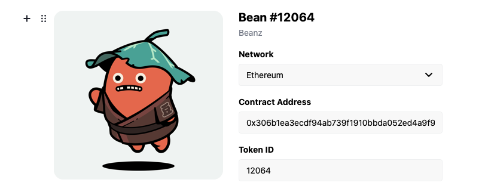

> 🚀 The development of this tool is sponsored by [Share](https://theshr.xyz) team — a decentralized social network for creators.

# NFT Block Tool for Editor.js

This Tool allows you to embed NFTs into your Editor.js editor.



## Installation

### API server

You need to run a server that will provide the NFT data. For example in [./server/index.ts](./server/index.ts) we use [Alchecmy API](https://docs.alchemy.com/reference/api-overview) to get the data.

You can run it with `npm run server`. It will run on port 3000.

Create a `.env` file as a copy of `.env.sample` in the root of the project and fill the values.

### Tool itself

Use your package manager to install the package `@editorjs/nft`.

```
npm install @editorjs/nft

yarn add @editorjs/nft
```

Then import tool to the page with Editor.js.

```
import NftTool from '@editorjs/nft';

const editor = new EditorJS({
  tools: {
    nft: {
      class: NftTool,
      config: {
        endpoint: 'http://localhost:3000/alchemy',
      }
    },
  },

  // ...
});
```

Check out the [example page](./index.html).

## Configuration

You have to define the endpoint of the API server in the config.

Check the NftToolConfig interface in [src/types/index.ts](./src/types/index.ts) file with types.

## Output Data

Check the NftToolData interface in [src/types/index.ts](./src/types/index.ts) file with types.


## Development

This tool uses [Vite](https://vitejs.dev/) as builder.

`npm run dev` — run development environment with hot reload

`npm run build` — build the tool for production to the `dist` folder

## Links

[Editor.js](https://editorjs.io) • [Create Tool](https://github.com/editor-js/create-tool)